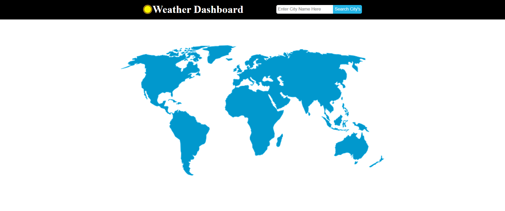
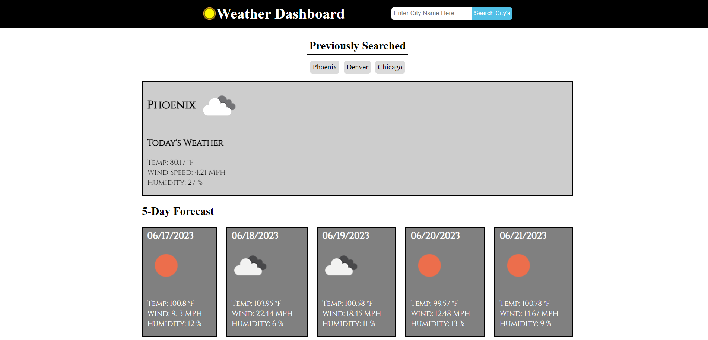

# green-weather

## Discription 

This challenge was to produce a application that shows weather information for the current date and a forecast of the following 5 days. I pulled the data needed to power the application from open weather API. The specific data needed to be pulled where the city, lat and lon, specific dates, temperature, wind speed, and humidity. So when a city is searched two sections will pull up and show todays weather and five day forecast. Also the city that was searched would be stored local. A button is then produce for the previous search that the user can click and set thoughs citys weather again. 

## Mock-up

## Deployment Links

deploy - https://mrgreen12375.github.io/green-weather/

github repo -  https://github.com/mrgreen12375/green-weather
